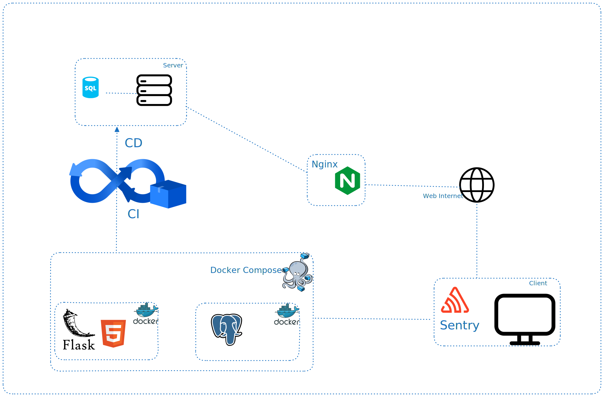
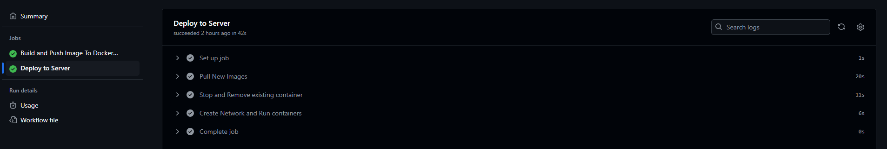
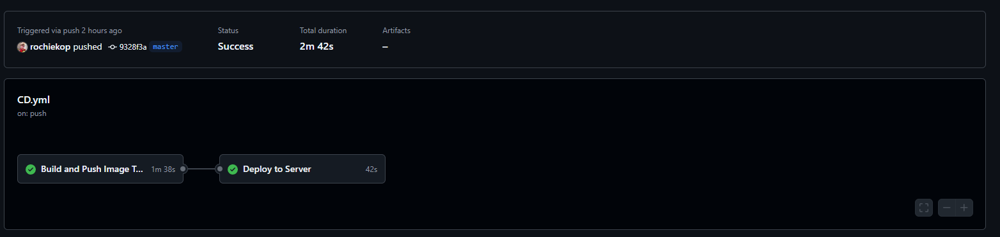
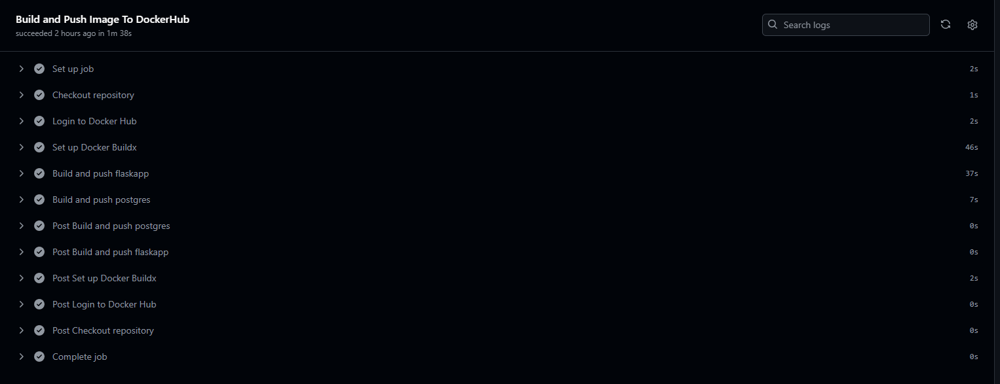
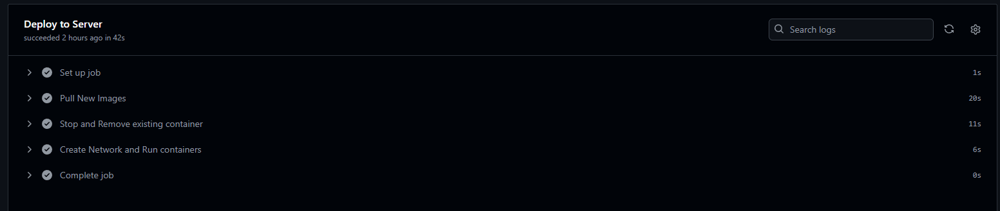
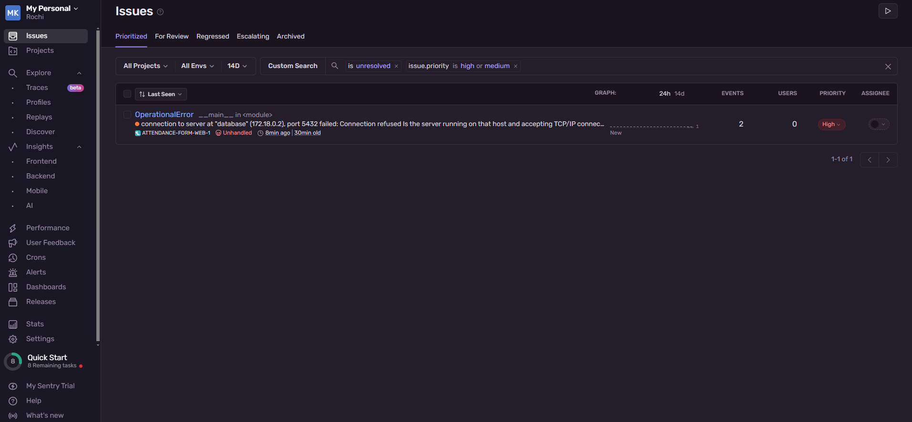

# Simple Attendance Form

## Description

This is a simple attendance tracking system built using Docker Compose, Docker, Nginx, Sentry, PostgreSQL, Flask, and an HTML Form. The project also includes a CI/CD pipeline setup to streamline the build, test, and deployment process.

## Topology
 

Features:

- **Frontend**: HTML form to submit attendance details.
- **Backend**: Flask application to handle form submissions and store data.
- **Database**: PostgreSQL to manage attendance records.
- **Error Monitoring**: Sentry integration for tracking and managing application errors.
- **Reverse Proxy**: Nginx to serve the Flask app.
- **CI/CD**: Build pipeline to automate testing and deployment.
- **Containerized**: Fully containerized using Docker and orchestrated with Docker Compose.

## CI/CD Workflows
Continuous Integration

 

Continuous Delivery and Continuous Deployment

 
 
 

## Sentry Monitoring
 

## Requirements
- `Docker`
- `Python 3.8`
- `Sentry`
- `Nginx`
- `Virtualenv`
